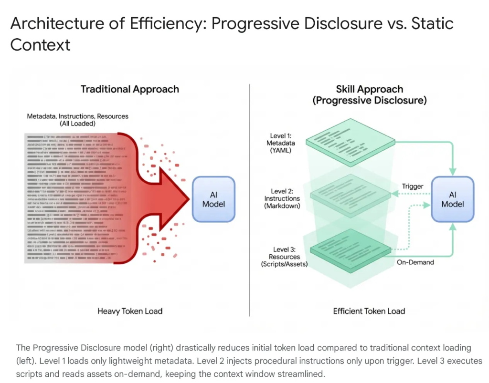

# Agent Skills Configuration Guide

Skills are structured modules that extend the capabilities of AI coding assistants, containing specialized instructions (prompts), scripts, and resources.

## Why Skills

Modern AI agents have evolved from simple listeners to complex reasoners that integrate with local file systems and external tools (via MCP servers). However, indiscriminately loading an agent with entire codebases and hundreds of tools leads to Context Saturation and "Tool Bloat." Even with large context windows, dumping 40–50k tokens of unused tools into active memory causes high latency, financial waste, and "context rot," where the model becomes confused by irrelevant data.

**The Solution: Agent Skills**

To solve this, Anthropic introduced Agent Skills, shifting the architecture from monolithic context loading to Progressive Disclosure. Instead of forcing the model to "memorize" every specific workflow (like database migrations or security audits) at the start of a session, these capabilities are packaged into modular, discoverable units.

**How It Works**

The model is initially exposed only to a lightweight "menu" of metadata. It loads the heavy procedural knowledge (instructions and scripts) only when the user's intent specifically matches a skill. This ensures that a developer asking to refactor authentication middleware gets security context without loading unrelated CSS pipelines, keeping the context lean, fast, and cost-effective.



## How the agent uses skills

Skills follow a progressive disclosure pattern:

- Discovery: When a conversation starts, the agent sees a list of available skills with their names and descriptions
- Activation: If a skill looks relevant to your task, the agent reads the full SKILL.md content
- Execution: The agent follows the skill's instructions while working on your task
  You don't need to explicitly tell the agent to use a skill—it decides based on context. However, you can

## Best practices

- **Keep skills focused**: Each skill should do one thing well. Instead of a "do everything" skill, create separate skills for distinct tasks.
- **Write clear descriptions**: The description is how the agent decides whether to use your skill. Make it specific about what the skill does and when it's useful.
- **Use scripts as black boxes**: If your skill includes scripts, encourage the agent to run them with --help first rather than reading the entire source code. This keeps the agent's context focused on the task.
- **Include decision trees**: For complex skills, add a section that helps the agent choose the right approach based on the situation.

## Directory Structure

Each Skill is a standalone folder with the following structure:

```text
skills/your-skill-name/
├── SKILL.md       # (Required) Core instruction file with YAML frontmatter
├── scripts/       # (Optional) Helper scripts or utilities
├── examples/      # (Optional) Reference examples
└── resources/     # (Optional) Templates or static assets

```

## 🔧 Configuration Paths

The following paths determine whether a Skill is active only for a specific project or globally across all projects.

### 1. Google Antigravity IDE

- **📂 Project Level:** `.agent/skills/`
- _Note:_ Create this folder in the project root.

- **👤 User Level (Global):** `~/.gemini/antigravity/global_skills/`
- _Note:_ Create in the user home directory; applies to all Antigravity projects.
- _Reference:_ [Google Antigravity Skills Documentation](https://antigravity.google/docs/skills)

### 2. Claude Code

- **📂 Project Level:** `.claude/skills/`
- _Note:_ Place Skill folders here; visible only to the current project.

- **👤 User Level (Global):** `~/.claude/skills/`
- _Note:_ Personal skill library available to all Claude Code sessions.
- _Reference:_ [Claude Code Skills Documentation](https://code.claude.com/docs/en/skills)

### 3. Cursor

- **📂 Project Level:** `.cursor/skills/`
- _Compatibility:_ Also supports `.claude/skills/`.
- _Note:_ Can be version-controlled with the project repository.

- **👤 User Level (Global):** `~/.cursor/skills/`
- _Compatibility:_ Also supports `~/.claude/skills/`.
- _Note:_ Personal skills available globally across all windows.
- _Reference:_ [Cursor Skills Documentation](https://cursor.com/docs/context/skills)

### 4. Codex

- **📂 Project Level:** `.codex/skills/`
- _Note:_ Supports version control; Codex searches recursively up to the repo root.

- **👤 User Level (Global):** `~/.codex/skills/`
- _Note:_ Can also be defined via the `$CODEX_HOME/skills` environment variable.

- _Reference:_ [Codex Skills Documentation](https://developers.openai.com/codex/skills/)

---

## Creating a skill

To create a skill:

1. Create a folder for your skill in one of the skill directories
2. Add a SKILL.md file inside that folder

```
.agent/skills/
└─── my-skill/
└─── SKILL.md
```

Every skill needs a SKILL.md file with YAML frontmatter at the top:

```
---

name: my-skill
description: Helps with a specific task. Use when you need to do X or Y.

---

# My Skill

Detailed instructions for the agent go here.

## When to use this skill

- Use this when...
- This is helpful for...

## How to use it

Step-by-step guidance, conventions, and patterns the agent should follow.
```

| Field       | Required | Description                                                                                                                          |
| ----------- | -------- | ------------------------------------------------------------------------------------------------------------------------------------ |
| name        | No       | A unique identifier for the skill (lowercase, hyphens for spaces). Defaults to the folder name if not provided.                      |
| description | Yes      | A clear description of what the skill does and when to use it. This is what the agent sees when deciding whether to apply the skill. |

> Tip: Write your description in third person and include keywords that help the agent recognize when the skill is relevant. For example: "Generates unit tests for Python code using pytest conventions."

## Reference

- [Google Antigravity Skills Documentation](https://antigravity.google/docs/skills)
- [Claude Code Skills Documentation](https://code.claude.com/docs/en/skills)
- [Cursor Skills Documentation](https://cursor.com/docs/context/skills)
- [Codex Skills Documentation](https://developers.openai.com/codex/skills/)
- [Authoring Google Antigravity Skills](https://codelabs.developers.google.com/getting-started-with-antigravity-skills#0)
